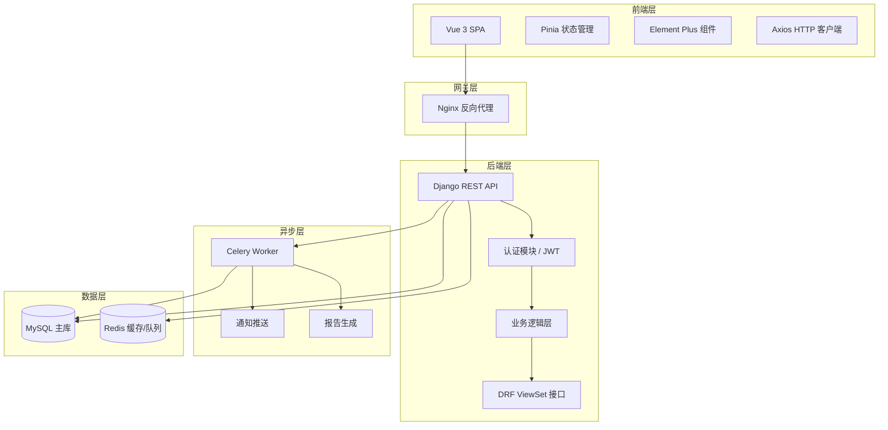
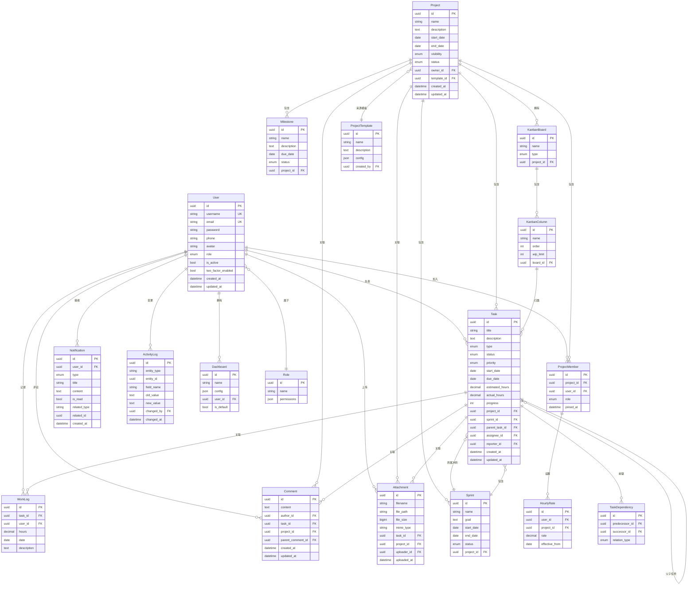
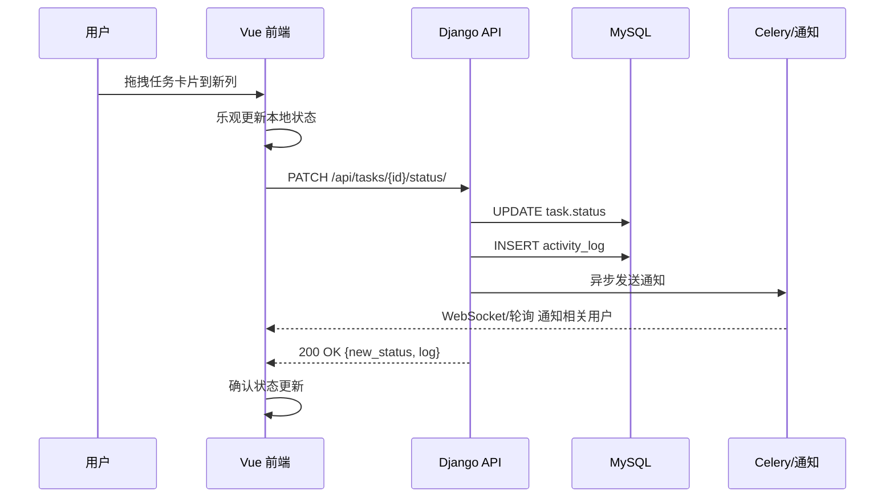
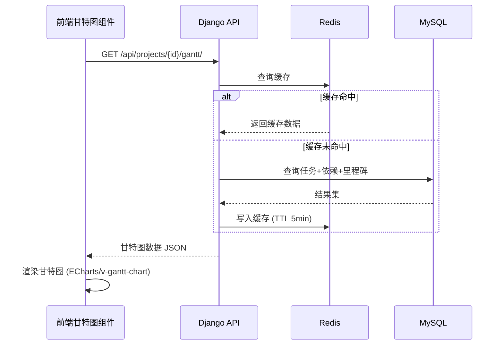
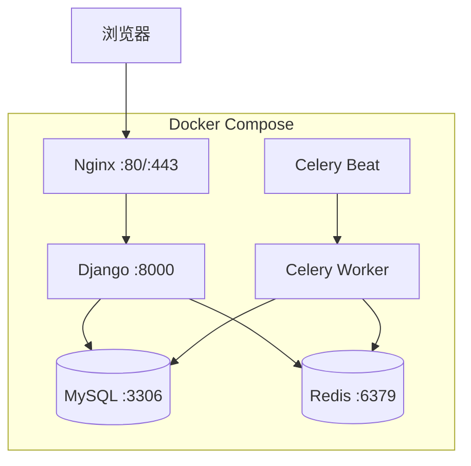

# 架构与类设计

## 1. 技术选型

### 1.1 选型结论

| 层级 | 技术 | 版本 |
|------|------|------|
| 前端框架 | Vue 3 + Vite | Vue ≥3.4 |
| UI 组件库 | Element Plus | ≥2.5 |
| 状态管理 | Pinia | ≥2.1 |
| HTTP 客户端 | Axios | ≥1.6 |
| 甘特图/图表 | ECharts + v-gantt-chart | - |
| 后端框架 | Django + DRF | Django ≥4.2, DRF ≥3.14 |
| 认证 | djangorestframework-simplejwt | - |
| API 文档 | drf-spectacular (OpenAPI 3) | - |
| 数据库 | MySQL | ≥8.0 |
| 缓存 | Redis | ≥7.0 |
| 异步任务 | Celery + Redis | - |
| 部署 | Docker + Docker Compose | - |

### 1.2 选型理由

**前端 Vue 3** 而非 React：
- 课程项目开发周期短（10 学时编码），Vue 模板语法上手更快
- 中文文档与社区生态更完善，降低学习成本
- Element Plus 提供项目管理类应用常用组件（表格、弹窗、表单），开箱即用

**后端 Django** 而非 SpringBoot：
- Python 语法简洁，团队快速原型开发效率更高
- Django ORM 迁移管理成熟，适合迭代中频繁调整表结构
- DRF 提供 ViewSet + Serializer 模式，CRUD 接口几乎零代码
- 内置 Admin 后台可用于数据管理调试

**MySQL**：
- 课程指定数据库，且项目管理数据关系强，适合关系型存储
- Django ORM 对 MySQL 支持成熟

**Redis + Celery**：
- 通知推送、报告生成等耗时操作通过异步任务处理，避免阻塞请求
- Redis 同时用于缓存甘特图数据、看板状态等高频查询

---

## 2. 系统架构

### 2.1 分层架构图



### 2.2 前端模块划分

```
frontend/src/
├── api/              # Axios 接口封装
├── components/       # 公共组件
│   ├── layout/       # 布局组件（导航栏、侧边栏）
│   ├── common/       # 通用组件（文件上传、用户选择器）
│   └── charts/       # 图表组件（甘特图、燃尽图）
├── composables/      # 组合式函数（权限、通知）
├── pages/            # 页面组件
│   ├── dashboard/    # 仪表盘
│   ├── project/      # 项目列表/详情/设置
│   ├── task/         # 任务列表/看板
│   ├── gantt/        # 甘特图
│   ├── sprint/       # 冲刺管理
│   ├── report/       # 报表
│   └── settings/     # 系统设置
├── stores/           # Pinia 状态
├── router/           # 路由配置
└── utils/            # 工具函数
```

### 2.3 后端模块划分

```
backend/
├── config/           # Django 配置（settings 拆分）
├── apps/
│   ├── accounts/     # 用户与认证
│   ├── projects/     # 项目与成员
│   ├── tasks/        # 任务与依赖
│   ├── kanban/       # 看板
│   ├── sprints/      # 冲刺与敏捷
│   ├── worklogs/     # 工时管理
│   ├── notifications/# 通知系统
│   ├── reports/      # 报表生成
│   └── files/        # 文件管理
├── core/             # 公共基类（BaseModel、分页、异常处理）
└── tasks/            # Celery 异步任务
```

---

## 3. 类设计

### 3.1 用户与权限模块

#### User（用户）

| 属性 | 类型 | 说明 |
|------|------|------|
| id | UUID | 主键 |
| username | VARCHAR(50) | 用户名，唯一 |
| email | VARCHAR(100) | 邮箱，唯一 |
| password | VARCHAR(255) | 密码（哈希存储） |
| phone | VARCHAR(20) | 手机号 |
| avatar | VARCHAR(255) | 头像 URL |
| role | ENUM | admin / manager / member |
| is_active | BOOLEAN | 是否激活 |
| two_factor_enabled | BOOLEAN | 双因素认证开关 |
| created_at | DATETIME | 创建时间 |
| updated_at | DATETIME | 更新时间 |

| 操作 | 说明 |
|------|------|
| register(data) | 用户注册 |
| login(username, password) | 用户登录，返回 JWT |
| updateProfile(data) | 更新个人信息 |
| changePassword(old, new) | 修改密码 |
| enable2FA() | 开启双因素认证 |
| getNotifications() | 获取个人通知列表 |

#### Role（角色）

| 属性 | 类型 | 说明 |
|------|------|------|
| id | UUID | 主键 |
| name | VARCHAR(50) | 角色名 |
| permissions | JSON | 权限列表 |

| 操作 | 说明 |
|------|------|
| assignToUser(user) | 将角色分配给用户 |
| updatePermissions(perms) | 更新权限配置 |

---

### 3.2 项目管理模块

#### Project（项目）

| 属性 | 类型 | 说明 |
|------|------|------|
| id | UUID | 主键 |
| name | VARCHAR(100) | 项目名称 |
| description | TEXT | 项目描述 |
| start_date | DATE | 开始日期 |
| end_date | DATE | 结束日期 |
| visibility | ENUM | public / private |
| status | ENUM | planning / active / completed / archived |
| owner_id | FK→User | 项目负责人 |
| template_id | FK→ProjectTemplate | 来源模板（可为空） |
| created_at | DATETIME | 创建时间 |
| updated_at | DATETIME | 更新时间 |

| 操作 | 说明 |
|------|------|
| createProject(data) | 创建项目 |
| updateProject(data) | 更新项目信息 |
| closeProject() | 关闭/归档项目 |
| addMember(user, role) | 添加项目成员 |
| removeMember(user) | 移除项目成员 |
| getProgress() | 获取项目整体进度 |
| getGanttData() | 获取甘特图数据 |
| duplicateFromTemplate(tpl) | 从模板创建项目 |

#### ProjectMember（项目成员）

| 属性 | 类型 | 说明 |
|------|------|------|
| id | UUID | 主键 |
| project_id | FK→Project | 所属项目 |
| user_id | FK→User | 用户 |
| role | ENUM | manager / member / viewer |
| joined_at | DATETIME | 加入时间 |

| 操作 | 说明 |
|------|------|
| addMember(project, user, role) | 添加成员 |
| removeMember(project, user) | 移除成员 |
| updateRole(member, newRole) | 更新成员角色 |

#### ProjectTemplate（项目模板）

| 属性 | 类型 | 说明 |
|------|------|------|
| id | UUID | 主键 |
| name | VARCHAR(100) | 模板名称 |
| description | TEXT | 模板描述 |
| config | JSON | 模板配置（阶段、默认列等） |
| created_by | FK→User | 创建人 |

---

### 3.3 任务管理模块

#### Task（任务/工作包）

| 属性 | 类型 | 说明 |
|------|------|------|
| id | UUID | 主键 |
| title | VARCHAR(200) | 任务标题 |
| description | TEXT | 任务描述 |
| type | ENUM | task / milestone / bug / epic |
| status | ENUM | todo / in_progress / review / done / blocked |
| priority | ENUM | low / medium / high / urgent |
| start_date | DATE | 计划开始日期 |
| due_date | DATE | 截止日期 |
| estimated_hours | DECIMAL | 预估工时 |
| actual_hours | DECIMAL | 实际工时（汇总） |
| progress | INT | 进度百分比 0-100 |
| project_id | FK→Project | 所属项目 |
| sprint_id | FK→Sprint | 所属冲刺（可为空） |
| parent_task_id | FK→Task(自引用) | 父任务（可为空） |
| assignee_id | FK→User | 负责人 |
| reporter_id | FK→User | 创建人 |
| created_at | DATETIME | 创建时间 |
| updated_at | DATETIME | 更新时间 |

| 操作 | 说明 |
|------|------|
| createTask(data) | 创建任务 |
| updateTask(data) | 更新任务详情 |
| assignTo(user) | 分配负责人 |
| changeStatus(newStatus) | 变更任务状态 |
| addDependency(successor, type) | 添加任务依赖 |
| removeDependency(successor) | 移除任务依赖 |
| addAttachment(file) | 添加附件 |
| getChangeLog() | 查询变更记录 |

#### TaskDependency（任务依赖）

| 属性 | 类型 | 说明 |
|------|------|------|
| id | UUID | 主键 |
| predecessor_id | FK→Task | 前驱任务 |
| successor_id | FK→Task | 后继任务 |
| relation_type | ENUM | blocks / precedes / relates_to |

#### Milestone（里程碑）

| 属性 | 类型 | 说明 |
|------|------|------|
| id | UUID | 主键 |
| name | VARCHAR(100) | 里程碑名称 |
| description | TEXT | 描述 |
| due_date | DATE | 目标日期 |
| status | ENUM | pending / completed |
| project_id | FK→Project | 所属项目 |

---

### 3.4 敏捷看板模块

#### Sprint（冲刺）

| 属性 | 类型 | 说明 |
|------|------|------|
| id | UUID | 主键 |
| name | VARCHAR(100) | 冲刺名称 |
| goal | TEXT | 冲刺目标 |
| start_date | DATE | 开始日期 |
| end_date | DATE | 结束日期 |
| status | ENUM | planning / active / completed |
| project_id | FK→Project | 所属项目 |

| 操作 | 说明 |
|------|------|
| createSprint(data) | 创建冲刺 |
| startSprint() | 启动冲刺 |
| completeSprint() | 完成冲刺 |
| addTask(task) | 向冲刺添加任务 |
| removeTask(task) | 从冲刺移除任务 |
| getBurndownChart() | 获取燃尽图数据 |

#### KanbanBoard（看板）

| 属性 | 类型 | 说明 |
|------|------|------|
| id | UUID | 主键 |
| name | VARCHAR(100) | 看板名称 |
| type | ENUM | team / version / sub_project |
| project_id | FK→Project | 所属项目 |

| 操作 | 说明 |
|------|------|
| createBoard(data) | 创建看板 |
| addColumn(name, order) | 添加列 |
| moveTask(task, toColumn) | 移动任务卡片 |

#### KanbanColumn（看板列）

| 属性 | 类型 | 说明 |
|------|------|------|
| id | UUID | 主键 |
| name | VARCHAR(50) | 列名（如待办/进行中/已完成） |
| order | INT | 排序序号 |
| wip_limit | INT | 在制品限制（0=无限制） |
| board_id | FK→KanbanBoard | 所属看板 |

---

### 3.5 工时与成本模块

#### WorkLog（工时记录）

| 属性 | 类型 | 说明 |
|------|------|------|
| id | UUID | 主键 |
| task_id | FK→Task | 关联任务 |
| user_id | FK→User | 记录人 |
| hours | DECIMAL | 工时（小时） |
| date | DATE | 工作日期 |
| description | TEXT | 工作内容说明 |

| 操作 | 说明 |
|------|------|
| logWork(data) | 记录工时 |
| updateWorkLog(data) | 修改工时记录 |
| getTaskTotalHours(task) | 统计任务总工时 |
| getUserWeeklyReport(user, week) | 用户周工时统计 |

#### HourlyRate（工时费率）

| 属性 | 类型 | 说明 |
|------|------|------|
| id | UUID | 主键 |
| user_id | FK→User | 用户 |
| project_id | FK→Project | 项目 |
| rate | DECIMAL | 每小时费率 |
| effective_from | DATE | 生效日期 |

---

### 3.6 协作与通知模块

#### Comment（评论）

| 属性 | 类型 | 说明 |
|------|------|------|
| id | UUID | 主键 |
| content | TEXT | 评论内容 |
| author_id | FK→User | 评论人 |
| task_id | FK→Task | 关联任务 |
| project_id | FK→Project | 关联项目 |
| parent_comment_id | FK→Comment(自引用) | 父评论（回复功能） |
| created_at | DATETIME | 创建时间 |
| updated_at | DATETIME | 编辑时间 |

| 操作 | 说明 |
|------|------|
| addComment(entity, content) | 添加评论 |
| editComment(content) | 编辑评论 |
| deleteComment() | 删除评论 |
| mentionUsers(usernames) | @提及用户 |

#### Notification（通知）

| 属性 | 类型 | 说明 |
|------|------|------|
| id | UUID | 主键 |
| user_id | FK→User | 接收人 |
| type | ENUM | task_assigned / status_change / comment / deadline / mention |
| title | VARCHAR(200) | 通知标题 |
| content | TEXT | 通知内容 |
| is_read | BOOLEAN | 是否已读 |
| related_type | VARCHAR(50) | 关联实体类型 |
| related_id | UUID | 关联实体 ID |
| created_at | DATETIME | 通知时间 |

| 操作 | 说明 |
|------|------|
| send(user, type, content) | 发送通知 |
| markAsRead() | 标记已读 |
| markAllAsRead(user) | 全部标为已读 |

#### Attachment（附件）

| 属性 | 类型 | 说明 |
|------|------|------|
| id | UUID | 主键 |
| filename | VARCHAR(255) | 原始文件名 |
| file_path | VARCHAR(500) | 存储路径 |
| file_size | BIGINT | 文件大小（字节） |
| mime_type | VARCHAR(100) | 文件 MIME 类型 |
| task_id | FK→Task | 关联任务 |
| project_id | FK→Project | 关联项目 |
| uploader_id | FK→User | 上传人 |
| uploaded_at | DATETIME | 上传时间 |

| 操作 | 说明 |
|------|------|
| upload(file, entity) | 上传文件 |
| delete() | 删除文件（权限校验） |
| download() | 下载文件 |

---

### 3.7 审计与日志模块

#### ActivityLog（变更日志）

| 属性 | 类型 | 说明 |
|------|------|------|
| id | UUID | 主键 |
| entity_type | VARCHAR(50) | 实体类型（Task/Project/...） |
| entity_id | UUID | 实体 ID |
| field_name | VARCHAR(50) | 变更字段 |
| old_value | TEXT | 旧值 |
| new_value | TEXT | 新值 |
| changed_by | FK→User | 变更人 |
| changed_at | DATETIME | 变更时间 |

---

### 3.8 展示层模块

#### Dashboard（自定义仪表盘）

| 属性 | 类型 | 说明 |
|------|------|------|
| id | UUID | 主键 |
| name | VARCHAR(100) | 仪表盘名称 |
| config | JSON | 布局与小组件配置 |
| user_id | FK→User | 所属用户 |
| is_default | BOOLEAN | 是否为默认仪表盘 |

| 操作 | 说明 |
|------|------|
| createDashboard(data) | 创建仪表盘 |
| addWidget(widget) | 添加小组件 |
| saveLayout(layout) | 保存布局 |

---

## 4. ER 图



---

## 5. 核心接口设计概要

### 5.1 RESTful API 端点

| 模块 | 端点 | 方法 | 说明 |
|------|------|------|------|
| 认证 | `/api/auth/login/` | POST | 登录获取 JWT |
| 认证 | `/api/auth/register/` | POST | 注册 |
| 项目 | `/api/projects/` | GET/POST | 项目列表/创建 |
| 项目 | `/api/projects/{id}/` | GET/PUT/DELETE | 项目详情/更新/删除 |
| 项目 | `/api/projects/{id}/members/` | GET/POST | 成员列表/添加 |
| 任务 | `/api/tasks/` | GET/POST | 任务列表/创建 |
| 任务 | `/api/tasks/{id}/` | GET/PUT/DELETE | 任务详情/更新/删除 |
| 任务 | `/api/tasks/{id}/status/` | PATCH | 更新任务状态 |
| 任务 | `/api/tasks/{id}/dependencies/` | GET/POST | 查看/添加依赖 |
| 冲刺 | `/api/projects/{id}/sprints/` | GET/POST | 冲刺列表/创建 |
| 看板 | `/api/projects/{id}/boards/` | GET/POST | 看板列表/创建 |
| 看板 | `/api/boards/{id}/columns/` | GET/POST | 列管理 |
| 工时 | `/api/tasks/{id}/worklogs/` | GET/POST | 工时记录 |
| 通知 | `/api/notifications/` | GET | 通知列表 |
| 评论 | `/api/tasks/{id}/comments/` | GET/POST | 任务评论 |
| 报表 | `/api/projects/{id}/reports/` | POST | 生成报表 |

### 5.2 认证方案

- 使用 JWT（Access Token + Refresh Token）
- Access Token 有效期 30 分钟，Refresh Token 有效期 7 天
- 前端 Axios 拦截器自动刷新过期 Token
- 敏感操作（删除项目、修改权限）需二次验证

---

## 6. 数据流设计

### 6.1 看板拖拽状态变更流程



### 6.2 甘特图数据加载流程



---

## 7. 安全设计要点

| 措施 | 说明 |
|------|------|
| 密码哈希 | Django `make_password`（PBKDF2 + SHA256） |
| JWT 认证 | Access/Refresh Token 双令牌机制 |
| RBAC 权限 | 角色-权限模型，DRF Permission 类逐接口校验 |
| 项目级隔离 | 所有查询按 `project_id` 过滤，防止越权访问 |
| SQL 注入防护 | Django ORM 参数化查询 |
| XSS 防护 | Vue 模板默认转义 + DRF 输出转义 |
| 文件上传校验 | 白名单 MIME 类型 + 文件大小限制 |
| CORS | `django-cors-headers` 白名单配置 |

---

## 8. 部署架构



容器编排通过 `docker-compose.yml` 定义，支持一键启动全部服务。开发环境使用 Django `runserver`，生产环境通过 Gunicorn + Nginx 部署。
