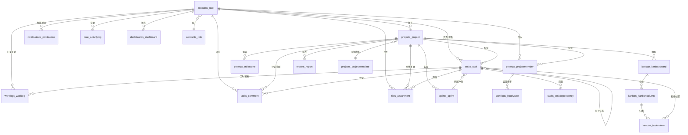

# 数据库设计

## 1. 数据库概述

| 属性 | 值 |
|------|-----|
| 数据库系统 | MySQL 8.0+ |
| 字符集 | utf8mb4 |
| 排序规则 | utf8mb4_unicode_ci |
| 存储引擎 | InnoDB |
| 主键策略 | UUID（CHAR(36)），由应用层生成 |
| 命名规范 | `{模块名}_{表名}` 小写 + 下划线 |

---

## 2. ER 图



---

## 3. 数据表设计

### 3.1 用户与权限 (accounts)

#### accounts_role — 角色

| 字段 | 类型 | 约束 | 说明 |
|------|------|------|------|
| id | CHAR(36) | PK | UUID |
| name | VARCHAR(50) | UQ, NN | 角色名 |
| description | VARCHAR(200) | | 角色描述 |
| permissions | JSON | NN | 权限配置 |
| created_at | DATETIME | | 创建时间 |
| updated_at | DATETIME | | 更新时间 |

预设角色：admin（全权限）、project_manager、developer、viewer。

#### accounts_user — 用户

| 字段 | 类型 | 约束 | 说明 |
|------|------|------|------|
| id | CHAR(36) | PK | UUID |
| username | VARCHAR(50) | UQ, NN | 用户名 |
| email | VARCHAR(100) | UQ, NN | 邮箱 |
| password | VARCHAR(255) | NN | 密码（PBKDF2 哈希） |
| phone | VARCHAR(20) | | 手机号 |
| avatar | VARCHAR(255) | | 头像 URL |
| role_id | CHAR(36) | FK→accounts_role | 角色外键 |
| role | ENUM | | admin / manager / member |
| is_active | TINYINT(1) | 默认 1 | 账户启用 |
| two_factor_enabled | TINYINT(1) | 默认 0 | 双因素认证 |
| last_login | DATETIME | | 最后登录时间 |
| created_at | DATETIME | | 创建时间 |
| updated_at | DATETIME | | 更新时间 |

索引：`idx_user_email`, `idx_user_username`

---

### 3.2 项目管理 (projects)

#### projects_projecttemplate — 项目模板

| 字段 | 类型 | 约束 | 说明 |
|------|------|------|------|
| id | CHAR(36) | PK | UUID |
| name | VARCHAR(100) | NN | 模板名称 |
| description | TEXT | | 描述 |
| config | JSON | NN | 默认阶段、看板列、任务类型等 |
| created_by | CHAR(36) | FK→accounts_user, NN | 创建人 |
| created_at | DATETIME | | 创建时间 |
| updated_at | DATETIME | | 更新时间 |

#### projects_project — 项目

| 字段 | 类型 | 约束 | 说明 |
|------|------|------|------|
| id | CHAR(36) | PK | UUID |
| name | VARCHAR(100) | NN | 项目名称 |
| description | TEXT | | 项目描述 |
| start_date | DATE | | 开始日期 |
| end_date | DATE | | 结束日期 |
| visibility | ENUM | 默认 private | public / private |
| status | ENUM | 默认 planning | planning / active / completed / archived |
| owner_id | CHAR(36) | FK→accounts_user, NN | 项目负责人 |
| template_id | CHAR(36) | FK→projecttemplate | 来源模板 |
| created_at | DATETIME | | 创建时间 |
| updated_at | DATETIME | | 更新时间 |

索引：`idx_project_status`, `idx_project_owner`

#### projects_projectmember — 项目成员

| 字段 | 类型 | 约束 | 说明 |
|------|------|------|------|
| id | CHAR(36) | PK | UUID |
| project_id | CHAR(36) | FK→project, NN | 项目 |
| user_id | CHAR(36) | FK→user, NN | 用户 |
| role | ENUM | 默认 member | manager / member / viewer |
| joined_at | DATETIME | | 加入时间 |

唯一约束：`uk_project_user (project_id, user_id)`
级联删除：删除项目或用户时自动清除成员记录

#### projects_milestone — 里程碑

| 字段 | 类型 | 约束 | 说明 |
|------|------|------|------|
| id | CHAR(36) | PK | UUID |
| name | VARCHAR(100) | NN | 里程碑名称 |
| description | TEXT | | 描述 |
| due_date | DATE | NN | 目标日期 |
| status | ENUM | 默认 pending | pending / completed |
| project_id | CHAR(36) | FK→project, NN | 所属项目 |
| created_at | DATETIME | | 创建时间 |

---

### 3.3 冲刺管理 (sprints)

#### sprints_sprint — 冲刺

| 字段 | 类型 | 约束 | 说明 |
|------|------|------|------|
| id | CHAR(36) | PK | UUID |
| name | VARCHAR(100) | NN | 冲刺名称 |
| goal | TEXT | | 冲刺目标 |
| start_date | DATE | NN | 开始日期 |
| end_date | DATE | NN | 结束日期 |
| status | ENUM | 默认 planning | planning / active / completed |
| project_id | CHAR(36) | FK→project, NN | 所属项目 |
| created_at | DATETIME | | 创建时间 |
| updated_at | DATETIME | | 更新时间 |

---

### 3.4 任务管理 (tasks)

#### tasks_task — 任务/工作包

| 字段 | 类型 | 约束 | 说明 |
|------|------|------|------|
| id | CHAR(36) | PK | UUID |
| title | VARCHAR(200) | NN | 任务标题 |
| description | TEXT | | 任务描述 |
| type | ENUM | 默认 task | task / milestone / bug / epic |
| status | ENUM | 默认 todo | todo / in_progress / review / done / blocked |
| priority | ENUM | 默认 medium | low / medium / high / urgent |
| start_date | DATE | | 计划开始日期 |
| due_date | DATE | | 截止日期 |
| estimated_hours | DECIMAL(8,2) | 默认 0 | 预估工时 |
| actual_hours | DECIMAL(8,2) | 默认 0 | 实际工时（汇总） |
| progress | INT | 默认 0 | 进度百分比 0-100 |
| project_id | CHAR(36) | FK→project, NN | 所属项目 |
| sprint_id | CHAR(36) | FK→sprint | 所属冲刺 |
| parent_task_id | CHAR(36) | FK→task(自引用) | 父任务 |
| assignee_id | CHAR(36) | FK→user | 负责人 |
| reporter_id | CHAR(36) | FK→user, NN | 创建人 |
| created_at | DATETIME | | 创建时间 |
| updated_at | DATETIME | | 更新时间 |

索引：project_id, sprint_id, assignee_id, status, priority, parent_task_id

#### tasks_taskdependency — 任务依赖

| 字段 | 类型 | 约束 | 说明 |
|------|------|------|------|
| id | CHAR(36) | PK | UUID |
| predecessor_id | CHAR(36) | FK→task, NN | 前驱任务 |
| successor_id | CHAR(36) | FK→task, NN | 后继任务 |
| relation_type | ENUM | 默认 precedes | blocks / precedes / relates_to |
| created_at | DATETIME | | 创建时间 |

唯一约束：`uk_dependency (predecessor_id, successor_id)`

---

### 3.5 看板管理 (kanban)

#### kanban_kanbanboard — 看板

| 字段 | 类型 | 约束 | 说明 |
|------|------|------|------|
| id | CHAR(36) | PK | UUID |
| name | VARCHAR(100) | NN | 看板名称 |
| type | ENUM | 默认 team | team / version / sub_project |
| project_id | CHAR(36) | FK→project, NN | 所属项目 |
| created_at | DATETIME | | 创建时间 |

#### kanban_kanbancolumn — 看板列

| 字段 | 类型 | 约束 | 说明 |
|------|------|------|------|
| id | CHAR(36) | PK | UUID |
| name | VARCHAR(50) | NN | 列名 |
| order | INT | 默认 0 | 排序序号 |
| wip_limit | INT | 默认 0 | 在制品限制（0=无限制） |
| board_id | CHAR(36) | FK→board, NN | 所属看板 |
| created_at | DATETIME | | 创建时间 |

#### kanban_taskcolumn — 任务-看板列关联

| 字段 | 类型 | 约束 | 说明 |
|------|------|------|------|
| id | CHAR(36) | PK | UUID |
| task_id | CHAR(36) | FK→task, NN | 任务 |
| column_id | CHAR(36) | FK→column, NN | 所在列 |
| order | INT | 默认 0 | 列内排序 |
| moved_at | DATETIME | | 移入时间 |

唯一约束：`uk_task_column (task_id, column_id)`

---

### 3.6 工时与成本 (worklogs)

#### worklogs_worklog — 工时记录

| 字段 | 类型 | 约束 | 说明 |
|------|------|------|------|
| id | CHAR(36) | PK | UUID |
| task_id | CHAR(36) | FK→task, NN | 关联任务 |
| user_id | CHAR(36) | FK→user, NN | 记录人 |
| hours | DECIMAL(6,2) | NN | 工时（小时） |
| date | DATE | NN | 工作日期 |
| description | TEXT | | 工作内容说明 |
| created_at | DATETIME | | 创建时间 |
| updated_at | DATETIME | | 更新时间 |

索引：`idx_worklog_task`, `idx_worklog_user`, `idx_worklog_date`

#### worklogs_hourlyrate — 工时费率

| 字段 | 类型 | 约束 | 说明 |
|------|------|------|------|
| id | CHAR(36) | PK | UUID |
| user_id | CHAR(36) | FK→user, NN | 用户 |
| project_id | CHAR(36) | FK→project, NN | 项目 |
| rate | DECIMAL(10,2) | NN | 每小时费率 |
| effective_from | DATE | NN | 生效日期 |
| created_at | DATETIME | | 创建时间 |

唯一约束：`uk_user_project_rate (user_id, project_id, effective_from)`

---

### 3.7 协作与评论 (tasks)

#### tasks_comment — 评论

| 字段 | 类型 | 约束 | 说明 |
|------|------|------|------|
| id | CHAR(36) | PK | UUID |
| content | TEXT | NN | 评论内容 |
| author_id | CHAR(36) | FK→user, NN | 评论人 |
| task_id | CHAR(36) | FK→task | 关联任务(可空) |
| project_id | CHAR(36) | FK→project | 关联项目(可空) |
| parent_comment_id | CHAR(36) | FK→comment(自引用) | 父评论(回复) |
| created_at | DATETIME | | 创建时间 |
| updated_at | DATETIME | | 编辑时间 |

约束：task_id 与 project_id 至少一个非空

#### tasks_mention — @提及

| 字段 | 类型 | 约束 | 说明 |
|------|------|------|------|
| id | CHAR(36) | PK | UUID |
| comment_id | CHAR(36) | FK→comment, NN | 所属评论 |
| mentioned_user_id | CHAR(36) | FK→user, NN | 被提及用户 |
| is_read | TINYINT(1) | 默认 0 | 已读状态 |
| created_at | DATETIME | | 创建时间 |

---

### 3.8 通知系统 (notifications)

#### notifications_notification — 通知

| 字段 | 类型 | 约束 | 说明 |
|------|------|------|------|
| id | CHAR(36) | PK | UUID |
| user_id | CHAR(36) | FK→user, NN | 接收人 |
| type | ENUM | NN | task_assigned / status_change / comment / deadline / mention / project_invite / sprint_start / sprint_end |
| title | VARCHAR(200) | NN | 通知标题 |
| content | TEXT | | 通知内容 |
| is_read | TINYINT(1) | 默认 0 | 已读状态 |
| related_type | VARCHAR(50) | | 关联实体类型 |
| related_id | CHAR(36) | | 关联实体 ID |
| created_at | DATETIME | | 通知时间 |

索引：`idx_notif_user (user_id, is_read)`, `idx_notif_created (created_at)`

---

### 3.9 文件管理 (files)

#### files_attachment — 附件

| 字段 | 类型 | 约束 | 说明 |
|------|------|------|------|
| id | CHAR(36) | PK | UUID |
| filename | VARCHAR(255) | NN | 原始文件名 |
| file_path | VARCHAR(500) | NN | 存储路径 |
| file_size | BIGINT | 默认 0 | 文件大小(字节) |
| mime_type | VARCHAR(100) | | MIME 类型 |
| task_id | CHAR(36) | FK→task | 关联任务 |
| project_id | CHAR(36) | FK→project | 关联项目 |
| uploader_id | CHAR(36) | FK→user, NN | 上传人 |
| uploaded_at | DATETIME | | 上传时间 |

---

### 3.10 审计日志 (core)

#### core_activitylog — 变更日志

| 字段 | 类型 | 约束 | 说明 |
|------|------|------|------|
| id | CHAR(36) | PK | UUID |
| entity_type | VARCHAR(50) | NN | 实体类型（Task / Project / Sprint ...） |
| entity_id | CHAR(36) | NN | 实体 ID |
| field_name | VARCHAR(50) | NN | 变更字段名 |
| old_value | TEXT | | 旧值 |
| new_value | TEXT | | 新值 |
| changed_by | CHAR(36) | FK→user, NN | 变更人 |
| changed_at | DATETIME | | 变更时间 |

索引：`idx_activity_entity (entity_type, entity_id)`, `idx_activity_changed_at`, `idx_activity_changed_by`

---

### 3.11 仪表盘 (dashboards)

#### dashboards_dashboard — 自定义仪表盘

| 字段 | 类型 | 约束 | 说明 |
|------|------|------|------|
| id | CHAR(36) | PK | UUID |
| name | VARCHAR(100) | NN | 仪表盘名称 |
| config | JSON | NN | 布局与小组件配置 |
| user_id | CHAR(36) | FK→user, NN | 所属用户 |
| is_default | TINYINT(1) | 默认 0 | 是否默认 |
| created_at | DATETIME | | 创建时间 |
| updated_at | DATETIME | | 更新时间 |

---

### 3.12 报表 (reports)

#### reports_report — 报表

| 字段 | 类型 | 约束 | 说明 |
|------|------|------|------|
| id | CHAR(36) | PK | UUID |
| name | VARCHAR(100) | NN | 报表名称 |
| type | ENUM | NN | task_list / worklog_summary / gantt / progress / burndown |
| project_id | CHAR(36) | FK→project, NN | 所属项目 |
| generated_by | CHAR(36) | FK→user, NN | 生成人 |
| parameters | JSON | | 生成参数 |
| file_path | VARCHAR(500) | | 导出文件路径 |
| created_at | DATETIME | | 生成时间 |

---

## 4. 表汇总

| 序号 | 模块 | 表名 | 说明 | 关联数 |
|------|------|------|------|--------|
| 1 | accounts | accounts_role | 角色 | 0 |
| 2 | accounts | accounts_user | 用户 | 1 FK |
| 3 | projects | projects_projecttemplate | 项目模板 | 1 FK |
| 4 | projects | projects_project | 项目 | 2 FK |
| 5 | projects | projects_projectmember | 项目成员 | 2 FK |
| 6 | projects | projects_milestone | 里程碑 | 1 FK |
| 7 | sprints | sprints_sprint | 冲刺 | 1 FK |
| 8 | tasks | tasks_task | 任务 | 6 FK |
| 9 | tasks | tasks_taskdependency | 任务依赖 | 2 FK |
| 10 | tasks | tasks_comment | 评论 | 4 FK |
| 11 | tasks | tasks_mention | @提及 | 2 FK |
| 12 | kanban | kanban_kanbanboard | 看板 | 1 FK |
| 13 | kanban | kanban_kanbancolumn | 看板列 | 1 FK |
| 14 | kanban | kanban_taskcolumn | 任务-列关联 | 2 FK |
| 15 | worklogs | worklogs_worklog | 工时记录 | 2 FK |
| 16 | worklogs | worklogs_hourlyrate | 工时费率 | 2 FK |
| 17 | notifications | notifications_notification | 通知 | 1 FK |
| 18 | files | files_attachment | 附件 | 3 FK |
| 19 | core | core_activitylog | 变更日志 | 1 FK |
| 20 | dashboards | dashboards_dashboard | 仪表盘 | 1 FK |
| 21 | reports | reports_report | 报表 | 2 FK |
| **合计** | | **21 张表** | | **36 个外键** |

---

## 5. 关键索引设计

| 表 | 索引名 | 字段 | 用途 |
|------|------|------|------|
| accounts_user | idx_user_email | email | 登录查询 |
| tasks_task | idx_task_project | project_id | 按项目筛选任务 |
| tasks_task | idx_task_assignee | assignee_id | 我的任务查询 |
| tasks_task | idx_task_status | status | 看板按状态筛选 |
| tasks_task | idx_task_sprint | sprint_id | 冲刺任务列表 |
| worklogs_worklog | idx_worklog_task | task_id | 任务工时统计 |
| worklogs_worklog | idx_worklog_date | date | 周报/月报统计 |
| notifications_notification | idx_notif_user | (user_id, is_read) | 未读通知查询 |
| core_activitylog | idx_activity_entity | (entity_type, entity_id) | 实体变更日志 |
| core_activitylog | idx_activity_changed_at | changed_at | 时间线查询 |

---

## 6. 状态流转规则

### 6.1 任务状态流转

```
todo ──→ in_progress ──→ review ──→ done
  │                         │
  └──────── blocked ←───────┘
```

- todo → in_progress：开始处理
- in_progress → review：提交审核
- review → done：审核通过
- review → in_progress：退回修改
- in_progress/todo → blocked：标记阻塞
- blocked → todo/in_progress：解除阻塞

### 6.2 项目状态流转

```
planning → active → completed → archived
```

### 6.3 冲刺状态流转

```
planning → active → completed
```

---

## 7. 数据安全性

| 层级 | 措施 |
|------|------|
| 存储层 | InnoDB 支持行级锁 + 事务 + 外键约束确保引用完整性 |
| 传输层 | HTTPS + JWT 认证 |
| 应用层 | 密码 PBKDF2 哈希存储；所有查询按 project_id 隔离 |
| 备份 | MySQL 定时备份 + binlog 增量恢复 |
| 审计 | core_activitylog 记录所有关键字段变更 |
| 文件 | 上传白名单校验 MIME + 大小限制 |

---

## 8. 预估数据量

以课程项目规模（20 人团队使用）预估：

| 表 | 预估行数 | 说明 |
|------|------|------|
| accounts_user | ~50 | 团队+测试账号 |
| projects_project | ~10 | 并行项目 |
| tasks_task | ~500 | 每项目约 50 任务 |
| worklogs_worklog | ~2000 | 每任务 4 条记录 |
| notifications_notification | ~5000 | 随使用累积 |
| core_activitylog | ~10000 | 高频写入表 |

总量预估 <10 万行，单表最高约 1 万行，属于轻量级 OLTP 场景，MySQL 在无索引优化情况下也可轻松应对。
