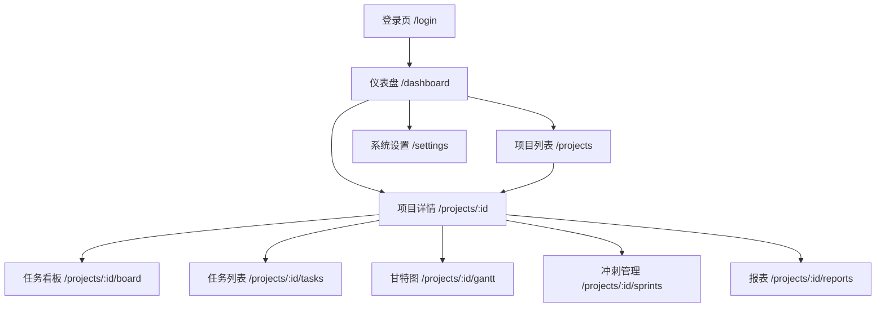

# 前端 UI 设计文档

## 1. 设计概述

| 项目 | 说明 |
|------|------|
| 前端框架 | Vue 3 (Composition API) |
| UI 组件库 | Element Plus |
| 图标库 | Element Plus Icons |
| 图表库 | ECharts 5 |
| 样式方案 | SCSS + Element Plus CSS Variables |
| 路由 | Vue Router 4 |
| 状态管理 | Pinia |

---

## 2. 设计系统

### 2.1 色彩方案

```scss
// 主色 - 科技蓝
$primary:       #409EFF;
$primary-light: #66B1FF;
$primary-dark:  #3A8EE6;

// 功能色
$success: #67C23A;   // 完成/通过
$warning: #E6A23C;   // 警告/延期
$danger:  #F56C6C;   // 错误/阻塞/删除
$info:    #909399;    // 信息/中性

// 中性色
$bg-page:     #F2F3F5;  // 页面背景
$bg-card:     #FFFFFF;  // 卡片背景
$border:      #DCDFE6;  // 边框
$text-primary:   #303133;
$text-regular:   #606266;
$text-secondary: #909399;

// 任务状态色
$status-todo:       #909399;  // 待办 - 灰色
$status-in-progress: #409EFF; // 进行中 - 蓝色
$status-review:     #E6A23C;  // 审核中 - 橙色
$status-done:       #67C23A;  // 已完成 - 绿色
$status-blocked:    #F56C6C;  // 阻塞 - 红色

// 优先级色
$priority-low:    #909399;
$priority-medium: #409EFF;
$priority-high:   #E6A23C;
$priority-urgent: #F56C6C;
```

### 2.2 间距与圆角

```scss
$spacing-xs: 4px;
$spacing-sm: 8px;
$spacing-md: 16px;
$spacing-lg: 24px;
$spacing-xl: 32px;

$radius-sm: 4px;
$radius-md: 8px;
$radius-lg: 12px;
```

### 2.3 字号层级

| 层级 | 大小 | 用途 |
|------|------|------|
| H1 | 24px | 页面标题 |
| H2 | 20px | 区块标题 |
| H3 | 16px | 卡片标题 |
| Body | 14px | 正文 |
| Caption | 12px | 辅助文字、时间戳 |

---

## 3. 页面导航结构



### 3.1 路由与权限矩阵

| 路由 | 页面 | 访问角色 |
|------|------|---------|
| `/login` | 登录页 | 未登录用户 |
| `/dashboard` | 个人仪表盘 | 所有用户 |
| `/projects` | 项目列表 | 所有用户 |
| `/projects/:id` | 项目概览 | 项目成员 |
| `/projects/:id/tasks` | 任务列表 | 项目成员 |
| `/projects/:id/board` | 任务看板 | 项目成员 |
| `/projects/:id/gantt` | 甘特图 | 项目成员 |
| `/projects/:id/sprints` | 冲刺管理 | manager |
| `/projects/:id/reports` | 报表 | manager |
| `/settings` | 系统设置 | admin |

---

## 4. 页面设计

### 4.1 登录页 `/login`

```
┌─────────────────────────────────────────┐
│                                         │
│         [ 软件项目管理平台 Logo ]        │
│                                         │
│   ┌───────────────────────────────┐     │
│   │  用户名  [________________]   │     │
│   │  密码    [________________]   │     │
│   │  □ 记住我                     │     │
│   │  [        登 录        ]      │     │
│   │  没有账号？立即注册           │     │
│   └───────────────────────────────┘     │
│                                         │
└─────────────────────────────────────────┘
```

- 中置卡片布局，全屏居中
- 表单校验：用户名/密码非空
- 登录失败顶部红色提示
- 登录成功跳转 `/dashboard`

### 4.2 整体布局框架（登录后所有页面）

```
┌──────┬──────────────────────────────────┐
│      │  Navbar: Logo | 通知图标(红点) |  │
│      │  用户头像+下拉菜单               │
│ Side ├──────────────────────────────────┤
│ bar  │                                  │
│      │                                  │
│ ──   │        <router-view />           │
│ 仪表  │        页面内容区                │
│ 盘   │                                  │
│ 项目  │                                  │
│ 设置  │                                  │
│      │                                  │
└──────┴──────────────────────────────────┘
```

- 侧边栏宽度 220px，可折叠至 64px
- 侧边栏菜单项：仪表盘、项目列表、系统设置
- 进入项目后，侧边栏切换为项目子导航：概览、任务、看板、甘特图、冲刺、报表
- 顶栏 56px，包含面包屑、通知铃铛（未读红点徽标）、用户下拉菜单

### 4.3 仪表盘 `/dashboard`

```
┌──────────────────────────────────────────┐
│  👋 你好，张三                            │
│                                          │
│  ┌──────┐ ┌──────┐ ┌──────┐ ┌──────┐   │
│  │ 2    │ │ 12   │ │ 3    │ │ 85%  │   │
│  │ 项目  │ │ 任务  │ │ 冲刺  │ │完成率│   │
│  └──────┘ └──────┘ └──────┘ └──────┘   │
│                                          │
│  ┌─ 我的任务 ─────────────────────────┐  │
│  │  ☐ 设计ER图         🔴高 05/07    │  │
│  │  ☐ 编写API文档      🟡中 05/10    │  │
│  │  ☐ 代码审查         🔵低 05/12    │  │
│  └────────────────────────────────────┘  │
│                                          │
│  ┌─ 最近项目 ─────────────────────────┐  │
│  │  📁 课程设计项目   进度 65% ████   │  │
│  │  📁 个人博客       进度 30% ██     │  │
│  └────────────────────────────────────┘  │
│                                          │
│  ┌─ 最近活动 ─────────────────────────┐  │
│  │  张三 将任务设为已完成    2分钟前   │  │
│  │  李四 创建了新任务       1小时前    │  │
│  └────────────────────────────────────┘  │
└──────────────────────────────────────────┘
```

**交互行为：**
- 统计卡片数字动画入场
- "我的任务"行点击可勾选完成（乐观更新）
- "最近项目"卡片点击跳转项目详情
- 活动流自动更新时间戳为相对时间

### 4.4 项目列表 `/projects`

```
┌──────────────────────────────────────────┐
│  项目列表              [+ 创建项目]      │
│  ┌──────────────────────────────────────┐│
│  │ 🔍 搜索  [筛选: 全部▼] [排序: 最新▼]││
│  └──────────────────────────────────────┘│
│                                          │
│  ┌──────────┐ ┌──────────┐ ┌──────────┐ │
│  │📁 项目A  │ │📁 项目B  │ │📁 项目C  │ │
│  │ 进行中   │ │ 规划中   │ │ 已完成   │ │
│  │ 成员:8   │ │ 成员:5   │ │ 成员:6   │ │
│  │ 进度 65% │ │ 进度 20% │ │ 进度100% │ │
│  │████  ██  │ │███       │ │████████  │ │
│  │[进入项目]│ │[进入项目]│ │[进入项目]│ │
│  └──────────┘ └──────────┘ └──────────┘ │
└──────────────────────────────────────────┘
```

**交互行为：**
- 搜索框支持项目名称模糊搜索
- 状态筛选：全部 / 规划 / 进行中 / 已完成 / 归档
- 卡片网格布局，hover 时上浮阴影
- 点击"创建项目"弹出对话框（Element Plus Dialog）
- 项目卡片：进度条颜色根据进度变化（<30% 红，30-80% 蓝，>80% 绿）

### 4.5 项目详情 `/projects/:id`

```
┌──────────────────────────────────────────┐
│  ← 返回   课程设计项目  [编辑] [⚙设置]   │
│  ┌─ 概览 ──────────────────────────────┐ │
│  │ 进度 65%  ████████░░░░  开始 03/01  │ │
│  │ 任务 12/18  里程碑 3/5  结束 06/30  │ │
│  └─────────────────────────────────────┘ │
│                                          │
│  ┌─ 成员 ────┐ ┌─ 里程碑 ─────────────┐ │
│  │ 👤 张三   │ │ ✅ 需求评审  05/15  │ │
│  │ 👤 李四   │ │ ⬜ 原型交付  05/30  │ │
│  │ 👤 王五   │ │ ⬜ 测试完成  06/15  │ │
│  │ [+邀请]   │ │ [+添加]            │ │
│  └───────────┘ └─────────────────────┘ │
│                                          │
│  ┌─ 最近活动 ─────────────────────────┐ │
│  │  张三 完成任务"设计ER图"   10分钟前  │ │
│  │  李四 创建任务"API开发"    1小时前   │ │
│  └─────────────────────────────────────┘ │
└──────────────────────────────────────────┘
```

**交互行为：**
- 顶部导航 Tab：概览 | 任务 | 看板 | 甘特图 | 冲刺 | 报表
- 进度环形图（ECharts）
- 成员头像组，hover 显示详情，点击"邀请"弹成员选择器
- 里程碑列表，点击切换完成状态

### 4.6 任务看板 `/projects/:id/board`

```
┌──────────────────────────────────────────┐
│  看板  [团队看板▼]  [+列]  [+任务]      │
│                                          │
│  ┌────────┐ ┌────────┐ ┌──────┐ ┌────┐ │
│  │📋待办  │ │🚀进行中│ │👀审核│ │✅完成│
│  │  3     │ │   5    │ │  2   │ │  8  │ │
│  │────────│ │────────│ │──────│ │─────│ │
│  │┌──────┐│ │┌──────┐│ │┌────┐│ │┌───┐│ │
│  ││任务A ││ ││任务C ││ ││任务││ ││   ││ │
│  ││🔴高  ││ ││🔵中  ││ ││E   ││ ││   ││ │
│  ││👤张三││ ││👤李四││ ││    ││ ││   ││ │
│  ││05/07 ││ ││05/10 ││ ││    ││ ││   ││ │
│  │└──────┘│ │└──────┘│ │└────┘│ │└───┘│ │
│  │┌──────┐│ │┌──────┐│ │┌────┐│ │     │ │
│  ││任务B ││ ││任务D ││ ││任务││ │     │ │
│  │└──────┘│ │└──────┘│ ││F   ││ │     │ │
│  │        │ │        │ │└────┘│ │     │ │
│  └────────┘ └────────┘ └──────┘ └─────┘ │
└──────────────────────────────────────────┘
```

**交互行为：**
- 列标题显示任务计数，超过 WIP 限制变红
- 任务卡片可拖拽到其他列（使用 vuedraggable 或 HTML5 Drag API）
- 拖拽时原列和目标列高亮
- 点击卡片弹出任务详情抽屉（右侧滑入）
- 点击"+"在列底部快速创建任务
- 卡片显示：标题、优先级色标、负责人头像、截止日期

### 4.7 任务列表 `/projects/:id/tasks`

```
┌──────────────────────────────────────────┐
│  任务列表  [+新任务]  [筛选▼] [排序▼]    │
│  ┌──────────────────────────────────────┐│
│  │☐ 任务名        优先级 负责人 截止  状态││
│  │──────────────────────────────────────││
│  │☐ 设计ER图      🔴高   张三  05/07 进行││
│  │☐ 编写API文档    🟡中   李四  05/10 待办││
│  │☐ 代码审查       🔵低   王五  05/12 待办││
│  │☐ 部署测试       🔴高   张三  05/15 阻塞││
│  └──────────────────────────────────────┘│
└──────────────────────────────────────────┘
```

**交互行为：**
- 表格行点击展开任务详情（内嵌展开行或侧边抽屉）
- 复选框勾选完成任务（仅当状态为 review 时可勾选）
- 列标题点击排序
- 筛选器：状态、优先级、负责人多选
- 行 hover 显示快速操作按钮（编辑/删除）

### 4.8 甘特图 `/projects/:id/gantt`

```
┌──────────────────────────────────────────┐
│  甘特图  [< 2026年5月 >] [今天] [缩放]   │
│                                          │
│  任务名       │ 5/01 │ 5/07 │ 5/14 │...  │
│  ──────────── │──────│──────│──────│     │
│  设计ER图     │██████│      │      │     │
│  编写API      │  ████████│      │     │
│  代码审查     │      │████  │      │     │
│  部署测试     │      │  ████████  │     │
│  ◆ 需求评审   │◆     │      │      │     │
│  ◆ 测试完成   │      │      │  ◆   │     │
│                                          │
│  ██ 任务  ◆ 里程碑  ─→ 依赖连线          │
└──────────────────────────────────────────┘
```

**交互行为：**
- 时间轴支持缩放（天/周/月视图）
- 任务条可拖拽调整起止日期
- 里程碑显示为菱形标记
- 依赖关系显示为连线箭头
- hover 任务条显示详情浮窗
- "今天"按钮一键定位到今天

### 4.9 冲刺管理 `/projects/:id/sprints`

```
┌──────────────────────────────────────────┐
│  冲刺管理  [+新建冲刺]                    │
│                                          │
│  ┌─ Sprint 1 (进行中) ─────────────────┐ │
│  │ 05/01 - 05/14  目标: 完成认证模块   │ │
│  │ 进度 60% ████████░░░░░░            │ │
│  │ ┌────┐ ┌────┐ ┌────┐              │ │
│  │ │任务│ │任务│ │任务│              │ │
│  │ └────┘ └────┘ └────┘              │ │
│  │ [查看燃尽图] [+添加任务]           │ │
│  └────────────────────────────────────┘ │
│                                          │
│  ┌─ Sprint 2 (规划中) ─────────────────┐ │
│  │ 05/15 - 05/28  目标: 完成核心功能   │ │
│  │ [启动冲刺]                          │ │
│  └────────────────────────────────────┘ │
└──────────────────────────────────────────┘
```

**交互行为：**
- 进行中的冲刺高亮显示
- "查看燃尽图"展开 ECharts 折线图（理想线 vs 实际线）
- "启动冲刺"按钮仅在当前无活跃冲刺时可用
- 完成任务时燃尽图实时更新

### 4.10 报表 `/projects/:id/reports`

```
┌──────────────────────────────────────────┐
│  报表                                    │
│  ┌─ 生成报表 ──────────────────────────┐ │
│  │ 类型: [任务列表▼]                   │ │
│  │ 时间: [05/01] - [05/31]             │ │
│  │ 格式: [PDF▼] [Excel] [CSV]          │ │
│  │ [          生成报表          ]       │ │
│  └─────────────────────────────────────┘ │
│                                          │
│  ┌─ 报表历史 ──────────────────────────┐ │
│  │ Sprint1进度报告  PDF  05/07  [下载] │ │
│  │ 工时统计表       Excel 05/01 [下载] │ │
│  └─────────────────────────────────────┘ │
└──────────────────────────────────────────┘
```

### 4.11 系统设置 `/settings`

```
┌──────────────────────────────────────────┐
│  系统设置                                │
│  ┌─ 个人资料 ─┐ ┌─ 安全设置 ───────────┐ │
│  │ 用户名:     │ │ 修改密码            │ │
│  │ 邮箱:       │ │ 双因素认证 [开/关]  │ │
│  │ 手机号:     │ └─────────────────────┘ │
│  └─────────────┘                         │
│  ┌─ 通知偏好 ──────────────────────────┐ │
│  │ ☑ 任务分配通知                      │ │
│  │ ☑ 状态变更通知                      │ │
│  │ ☑ 评论@提及通知                     │ │
│  │ ☐ 邮件通知                          │ │
│  └─────────────────────────────────────┘ │
│  ┌─ 主题设置 ──────────────────────────┐ │
│  │ 语言: [简体中文▼]                   │ │
│  │ 主题: ● 浅色  ○ 深色               │ │
│  └─────────────────────────────────────┘ │
└──────────────────────────────────────────┘
```

---

## 5. 公共组件清单

| 组件名 | 路径 | 说明 | 复用页面 |
|--------|------|------|---------|
| `AppLayout` | `components/layout/AppLayout.vue` | 整体布局（侧边栏+顶栏+内容） | 所有登录后页面 |
| `Navbar` | `components/layout/Navbar.vue` | 顶栏（面包屑+通知+用户菜单） | AppLayout 内 |
| `Sidebar` | `components/layout/Sidebar.vue` | 侧边栏导航 | AppLayout 内 |
| `TaskCard` | `components/common/TaskCard.vue` | 看板任务卡片（可拖拽） | 看板 |
| `TaskDialog` | `components/common/TaskDialog.vue` | 任务创建/编辑弹窗 | 任务列表、看板、仪表盘 |
| `TaskDrawer` | `components/common/TaskDrawer.vue` | 任务详情侧滑抽屉 | 看板、任务列表 |
| `ProjectCard` | `components/common/ProjectCard.vue` | 项目卡片 | 项目列表、仪表盘 |
| `UserSelector` | `components/common/UserSelector.vue` | 用户选择器（搜索+多选） | 任务分配、成员邀请 |
| `StatusTag` | `components/common/StatusTag.vue` | 状态标签（颜色映射） | 多处 |
| `PriorityTag` | `components/common/PriorityTag.vue` | 优先级标签 | 多处 |
| `NotificationBell` | `components/common/NotificationBell.vue` | 通知铃铛（未读计数） | Navbar 内 |
| `ActivityTimeline` | `components/common/ActivityTimeline.vue` | 活动时间线 | 仪表盘、项目详情 |
| `FileUploader` | `components/common/FileUploader.vue` | 文件上传组件 | 任务详情 |
| `CommentList` | `components/common/CommentList.vue` | 评论列表（含@提及） | 任务详情 |

---

## 6. Pinia Store 设计

| Store | 文件 | 核心 State | 说明 |
|-------|------|-----------|------|
| `useAuthStore` | `stores/auth.js` | user, token, isLoggedIn | 用户认证状态 |
| `useProjectStore` | `stores/project.js` | projects, currentProject | 项目数据 |
| `useTaskStore` | `stores/task.js` | tasks, currentTask, filters | 任务数据 |
| `useBoardStore` | `stores/board.js` | boards, columns, taskCards | 看板数据 |
| `useSprintStore` | `stores/sprint.js` | sprints, burndownData | 冲刺数据 |
| `useNotificationStore` | `stores/notification.js` | notifications, unreadCount | 通知状态 |
| `useAppStore` | `stores/app.js` | sidebarCollapsed, theme, locale | 全局 UI 状态 |

---

## 7. 响应式适配

| 断点 | 宽度 | 布局调整 |
|------|------|---------|
| Desktop | ≥1200px | 侧边栏展开 220px，卡片 3-4 列 |
| Tablet | 768px-1199px | 侧边栏折叠 64px，卡片 2 列 |
| Mobile | <768px | 侧边栏隐藏，底部 Tab 导航 |

---

## 8. 交互反馈规范

| 场景 | 反馈方式 |
|------|---------|
| 数据加载中 | Element Plus Skeleton / v-loading 指令 |
| 操作成功 | `ElMessage.success()` 顶部绿色提示 |
| 操作失败 | `ElMessage.error()` 顶部红色提示 |
| 危险操作 | `ElMessageBox.confirm()` 确认对话框 |
| 表单校验 | Element Plus Form 行内红色提示 |
| 空数据 | `ElEmpty` 组件 + 引导文案 |
| 网络错误 | 全局 Axios 拦截器统一 `ElMessage.error('网络异常，请稍后重试')` |

---

## 9. 页面文件映射

```
frontend/src/pages/
├── dashboard/Index.vue          # 仪表盘
├── project/List.vue              # 项目列表
├── project/Detail.vue            # 项目详情（含概览Tab）
├── task/Board.vue                # 任务看板
├── task/List.vue                 # 任务列表
├── gantt/Index.vue               # 甘特图
├── sprint/Index.vue              # 冲刺管理
├── report/Index.vue              # 报表
├── settings/Index.vue            # 系统设置
└── settings/Login.vue            # 登录页
```
